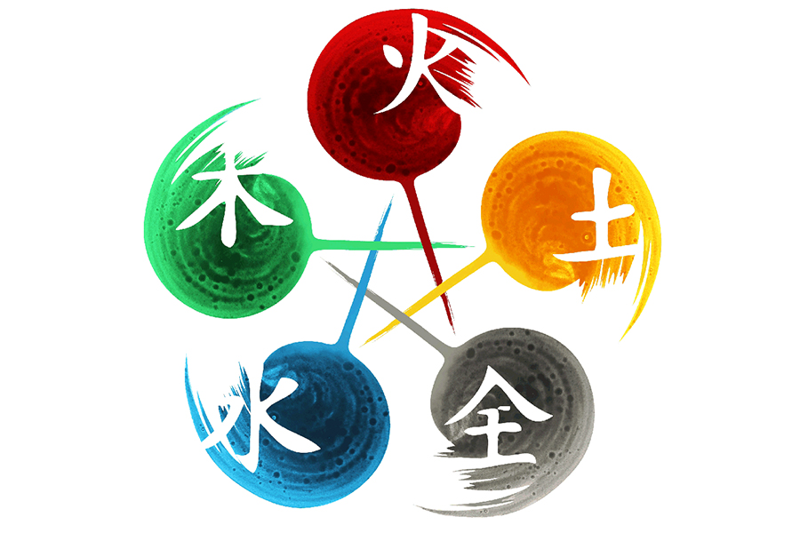

# CICLO SEXAGENARIO CHINO

## Zodíaco chino

Crea un método, que dado un año, indique el animal y elemento correspondiente en el ciclo sexagenario del zodíaco chino.

## Requisitos

* La información sobre el zodíaco chino puede extraerse de la siguiente página: [Zodíaco chino](https://www.travelchinaguide.com/intro/astrology/60year-cycle.htm).

* El ciclo sexagenario se corresponde con la combinación de los siguientes elementos y animales:
    * Elementos: **madera** , **fuego**, **tierra**, **metal** y **agua**.
    * Animales: **rata**, **buey**, **tigre**, **conejo**, **dragón**, **serpiente**, **caballo**, **oveja**, **mono**, **gallo**, **perro**, **cerdo**.
* Cada elemento se repite dos años seguidos.

* El último ciclo sexagenario comenzó en 1984 (***madera rata***).

## Extra
Como extra para este ejercicio decidí incluir la posibilidad de que después de elegir un año correcto y visualizar la respuesta tengamos que decidir si realizar otra búsqueda o finalizar la aplicación.