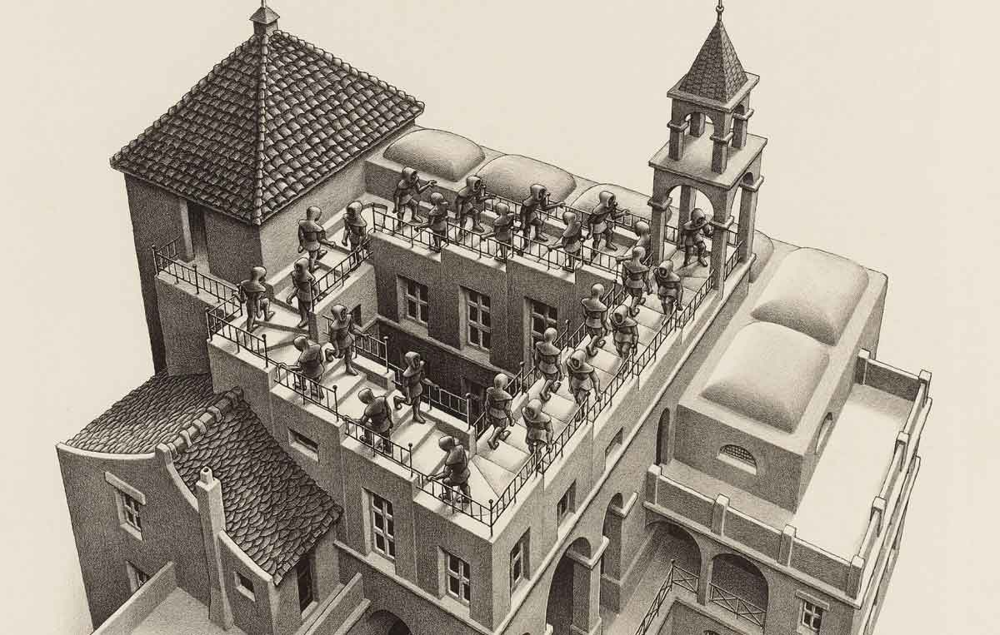

# LA ESCALERA

## La escalera

Crea una función que dibuje una escalera según su número de escalones.

## Requisitos

* Si el número es positivo, será ascendente de izquierda a derecha.
   
* Si el número es negativo, será descendente de izquierda a derecha.

* Si el número es cero, se dibujarán dos guiones bajos.

~~~
Ejemplo: 4
 *         _
 *       _|
 *     _|
 *   _|
 * _|
 *
~~~~