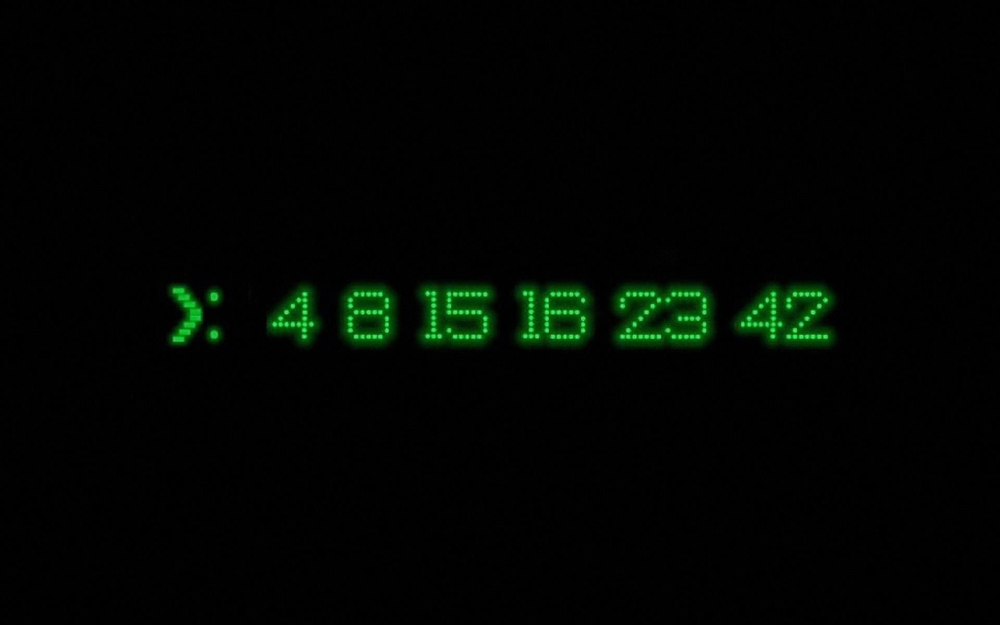

# LOS NÚMEROS PERDIDOS

## Los números perdidos

Dado un array de enteros ordenado y sin repetidos, crea una función que calcule y retorne todos los que faltan entre el menor y el mayor.

## Requisitos

* Lanza un error si el array de entrada no es correcto.
   