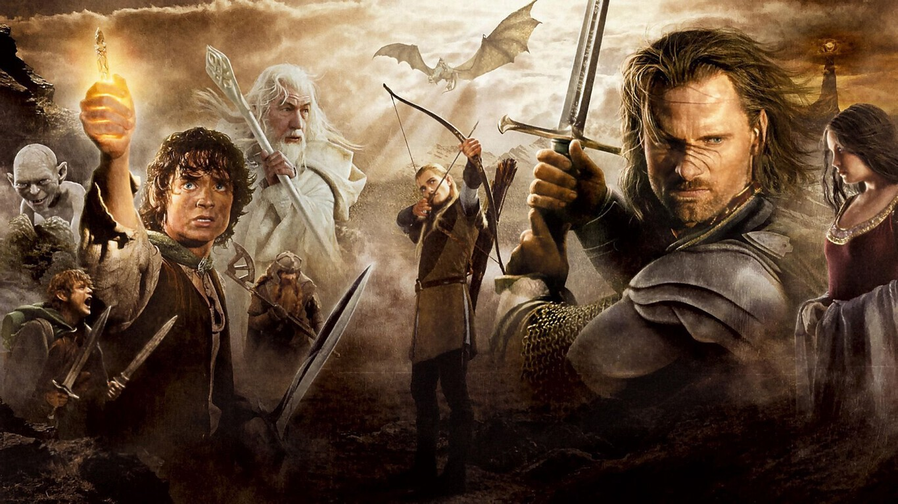

# LOS ANILLOS DE PODER

## ¡ La tierra Media está en peligro !

La tierra media está en guerra. En ella lucharán razas leales a Sauron contra otras bondadosas que no quieren que el mal reine sobre sus tierras.

## Requisitos

* Cada raza tiene asociado un **"valor"** entre **1** y **5**:

* Razas Bondadosas:
    * Pelosos **(1)**, Sureños buenos **(2)**, Enanos **(3)**, Númenóreanos **(4)**, Elfos **(5)**.

* Razas malvadas: 
    * Sureños malos **(2)**, Orcos **(2)**, Goblins **(2)**, Huargo **(3)**, Trolls **(5)**.

* Crea un programa que calcule el resultado de la batalla entre los 2 tipos de ejércitos:

    * El resultado puede ser que gane el bien, el mal, o exista un empate. Dependiendo de la suma del valor del ejército y el número de integrantes.

    * Cada ejército puede estar compuesto por un número de integrantes variable de cada raza.

* Tienes total libertad para modelar los datos del ejercicio.
    
    * Ejemplo: 

        1 Peloso pierde contra 1 Orco.

        2 Pelosos empatan contra 1 Orco.
        
        3 Pelosos ganan contra 1 Orco. 

## Extra
Como extra para este ejercicio decidí incluir la posibilidad de decidir mediante consola cuantos integrantes iba a tener cada ejercito. Y mostrar una información sobre el resultado de la batalla al finalizar la misma.